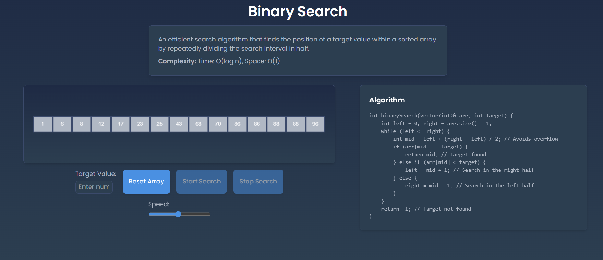
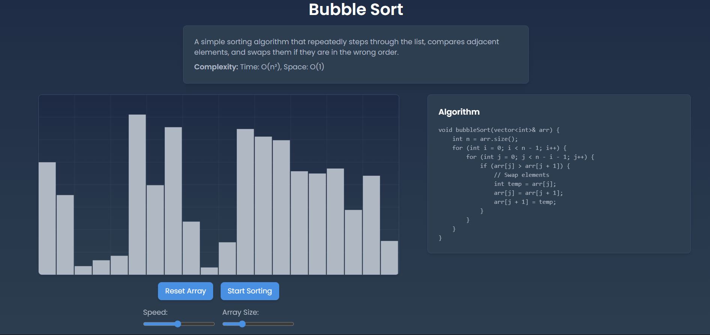
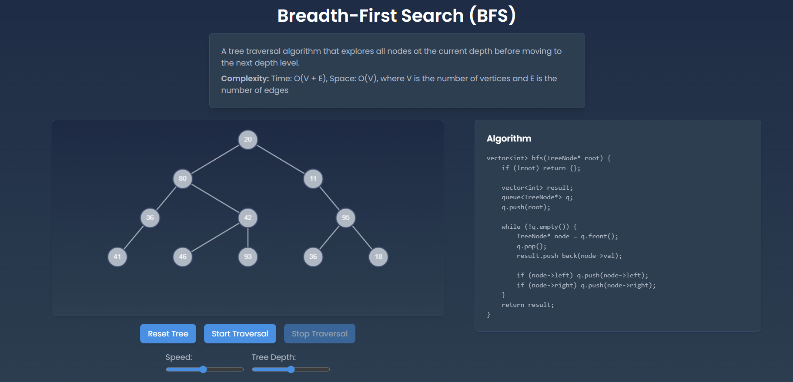
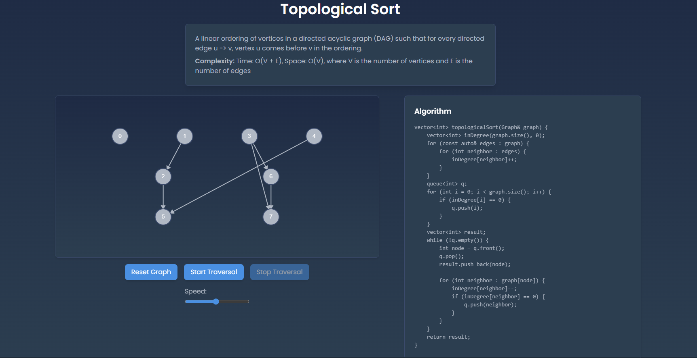

# 🐠 AlgoQuarium

**AlgoQuarium** is an interactive web application for visualizing classic data structures and algorithms. Dive into a vibrant aquarium of algorithms and watch them come to life through beautiful, intuitive animations!

---

## 🌟 Features

- **Searching Algorithms**  
  See how Linear Search and Binary Search work step by step.

- **Sorting Algorithms**  
  Visualize Bubble Sort, Selection Sort, Insertion Sort, Merge Sort, Quick Sort, and more.

- **Tree Traversal**  
  Explore BFS, Pre-order, In-order, and Post-order traversals on trees.

- **Graph Algorithms**  
  Understand BFS, DFS, Topological Sort, and Dijkstra’s Algorithm.

- **Backtracking**  
  (Coming Soon) N-Queens, Sudoku Solver, Maze Solver, and more.

- **Miscellaneous Problems**  
  (Coming Soon) Tower of Hanoi, Domino Effect, Game of Life, and more.

- **OS Scheduling Algorithms**  
  (Coming Soon) FCFS, SJF, Round Robin, and others.

- **Modern UI**  
  Built with React and Tailwind CSS for a sleek, responsive experience.

---

## 🚀 Getting Started

### Prerequisites

- [Node.js](https://nodejs.org/) (v16+ recommended)
- [npm](https://www.npmjs.com/) or [yarn](https://yarnpkg.com/)

### Installation

1. **Clone the repository:**
   ```sh
   git clone https://github.com/ashish7472/AlgoQuarium.git
   cd AlgoQuarium
   ```

2. **Install dependencies:**
   ```sh
   cd frontend
   npm install
   # or
   yarn install
   ```

3. **Start the development server:**
   ```sh
   npm start
   # or
   yarn start
   ```

4. **Open in your browser:**  
   Visit [http://localhost:3000](http://localhost:3000)

---

## 📸 Screenshots






---

## 👨‍💻 Author

**Ashish Rolan**  
- [GitHub](https://github.com/ashish7472)
- [LinkedIn](https://www.linkedin.com/in/ashish-rolan-7088a925b/)
- [Portfolio](https://ashish-rolan-portfolio.netlify.app/)

---

## 🤝 Contributing

Contributions, suggestions, and feedback are welcome!  
Feel free to open issues or submit pull requests.

---

## 📄 License

This project is licensed under the [MIT License](LICENSE).

---

## ⭐️ Show Your Support

If you like this project, please star the repo and share it with others!

---

> _Happy Learning and Visualizing!_